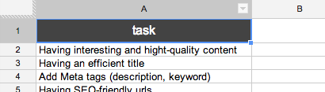

#TASKO

Tasko is a light and simple to-do list generator. You only have to create a **Google Spreadsheet** to use it. 

###Google Spreadsheet

Just create one column and write `task` as title. Publish, get the ID and paste it into Tasko.

###[Let's to-do it !](http://yago31.github.io/taskr)